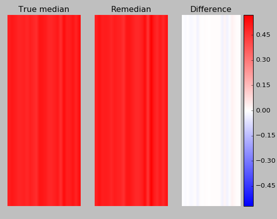

Examples
========
A straight forward example:

.. code-block:: python

    import matplotlib.pyplot as plt
    import numpy as np
    from remedian.remedian import Remedian

    # We can have data of any shape ... e.g., 3D:
    data_shape = (2,3,4)

    # Now we have to decide how many data observations we want to load into
    # memory at a time before computing a first intermediate median from it
    n_obs = 100

    # Pick some example number ... assume we have `t` arrays of shape `data_shape`
    # that we want to summarize with Remedian
    t = 500

    # Initialize the object
    r = Remedian(data_shape, n_obs, t)

    # Feed it the data ... for now, we just generate the data randomly on the go
    # ... also save the actual data for comparison with true median
    res = []
    for obs_i in range(t):
        obs = np.random.random(data_shape)
        r.add_obs(obs)
        res.append(obs)

    # Now we have the Remedian in `r.remedian`
    # Let's summarize the results
    x = np.median(np.asarray(res).squeeze(), axis=0)
    y = r.remedian
    xydiff = x-y

    # For colorbar scaling
    vmin = np.min([x.min(), y.min(), xydiff.min()])
    vmax = np.max([x.max(), y.max(), xydiff.max()])
    vmin = -1*np.max(np.abs([vmin, vmax]))
    vmax = np.max(np.abs([vmin, vmax]))

    # Plot it
    plt.close('all')

    plt.subplot(131)
    plt.imshow(x.reshape(1,-1), aspect='auto', cmap='bwr', vmin=vmin, vmax=vmax)
    plt.axis('off')
    plt.title('True median')

    plt.subplot(132)
    plt.imshow(y.reshape(1,-1), aspect='auto', cmap='bwr', vmin=vmin, vmax=vmax)
    plt.axis('off')
    plt.title('Remedian')

    plt.subplot(133)
    plt.imshow(xydiff.reshape(1,-1), aspect='auto', cmap='bwr', vmin=vmin, vmax=vmax)
    plt.axis('off')
    plt.colorbar()
    plt.title('Difference')

